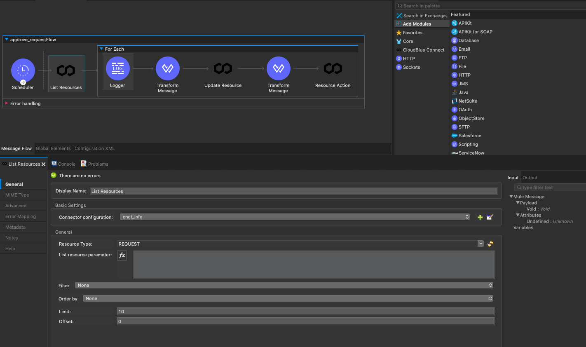
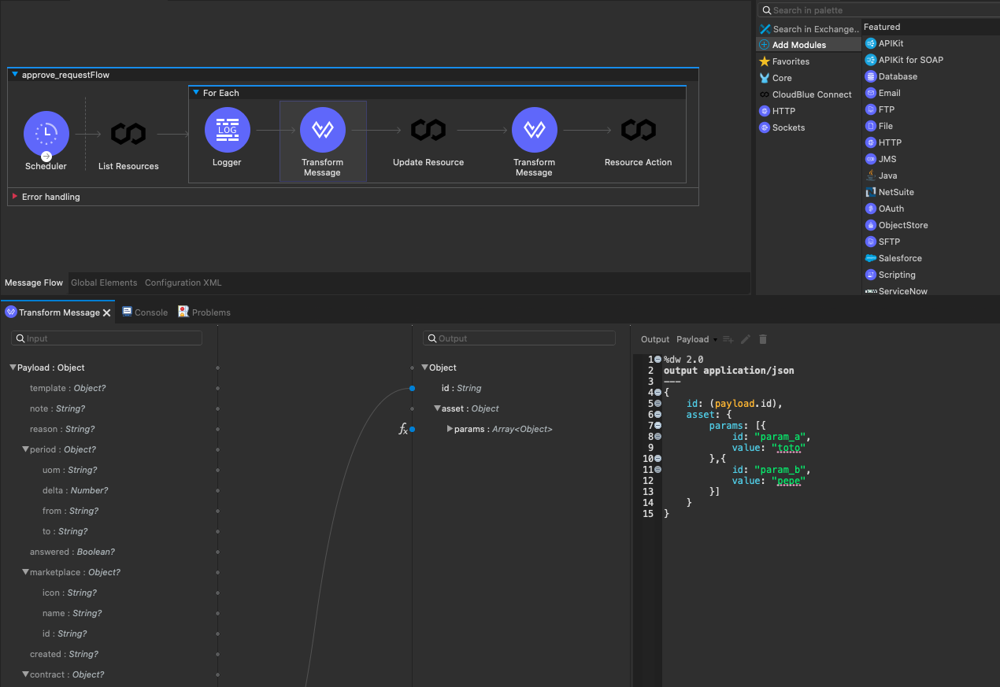
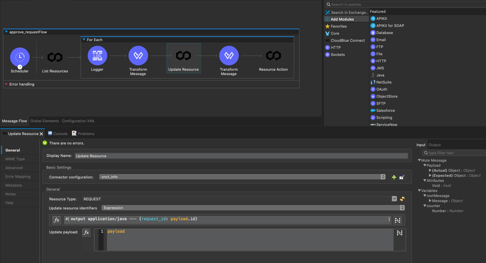
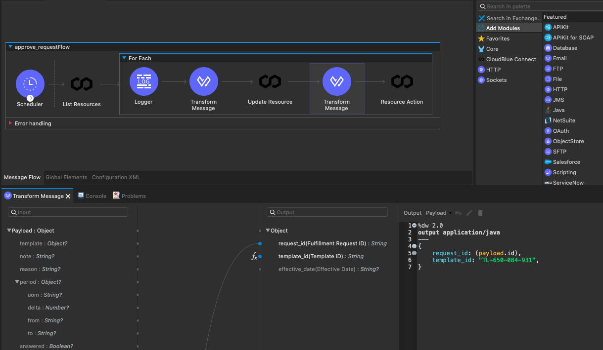
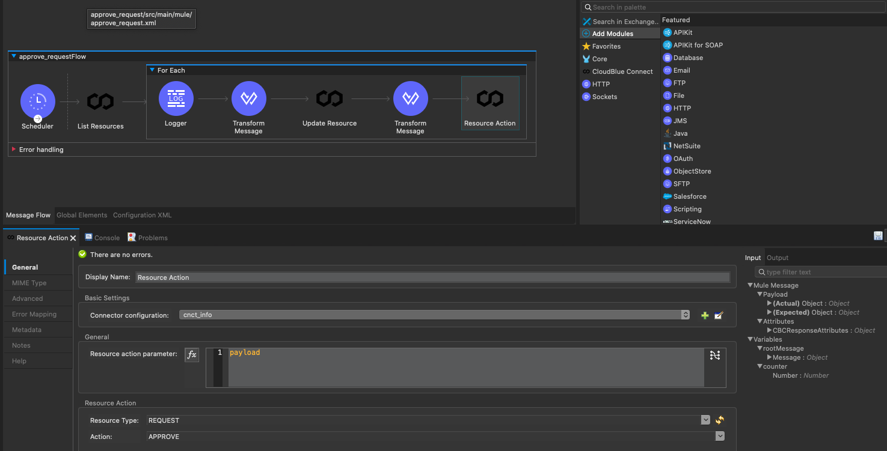

# Auto Approval process

This example shows an auto aproval process of the Asset Request.

The first step is a Scheduler step that triggers the process every 1 second. 

The next step obtains all the Assets Request in "pending" status.

With this result, a For Each block is implemented, into this block, every Asset Request will be processed. 
For that, a chain of steps are implemented:

1. The step "Transform Message" create a Json structure with the needed fulfillment parameters. In this example the values are harcoded. 

2. With the parameters created and formatted, the Asset Request is updated. 

3. Then a data structure is created with the "template_id". In this example this template ID is harcoded. To create this structure is used the "Transform Message" capability. 

4. Last using the "Resource Action" withjResource Type = REQUEST and Action = APPROVE the Asset request is approved. 

[In this link you can find the XML file corresponding to the integration.](approve_request.xml).

[And in this file you can see the pom.xml file](pom.xml).
